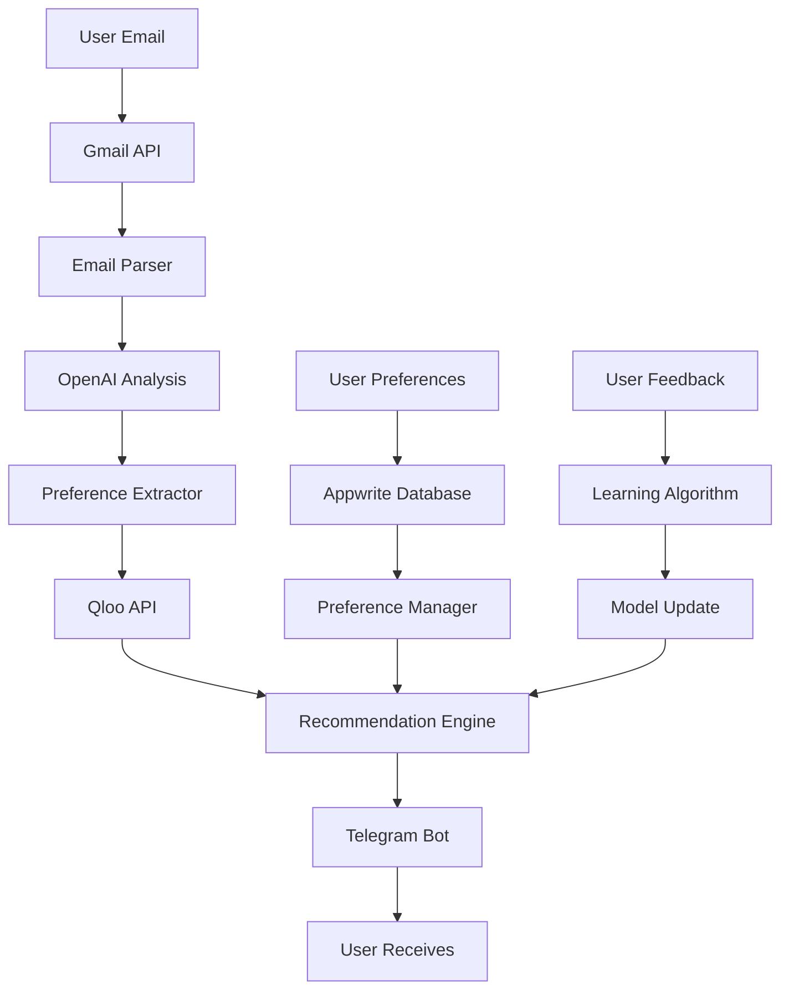
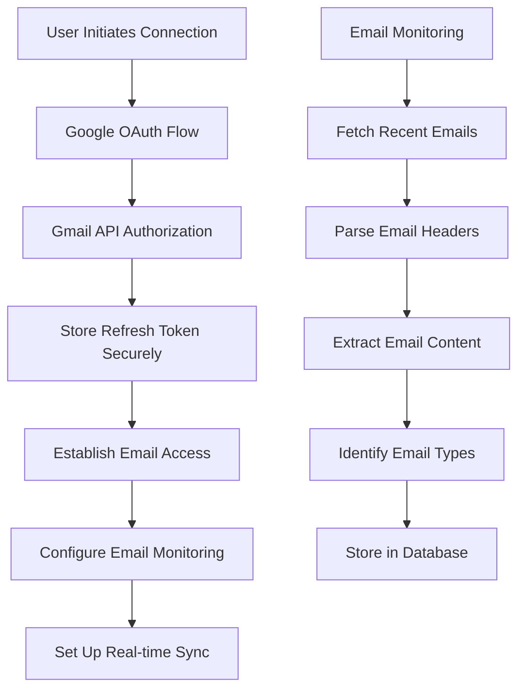
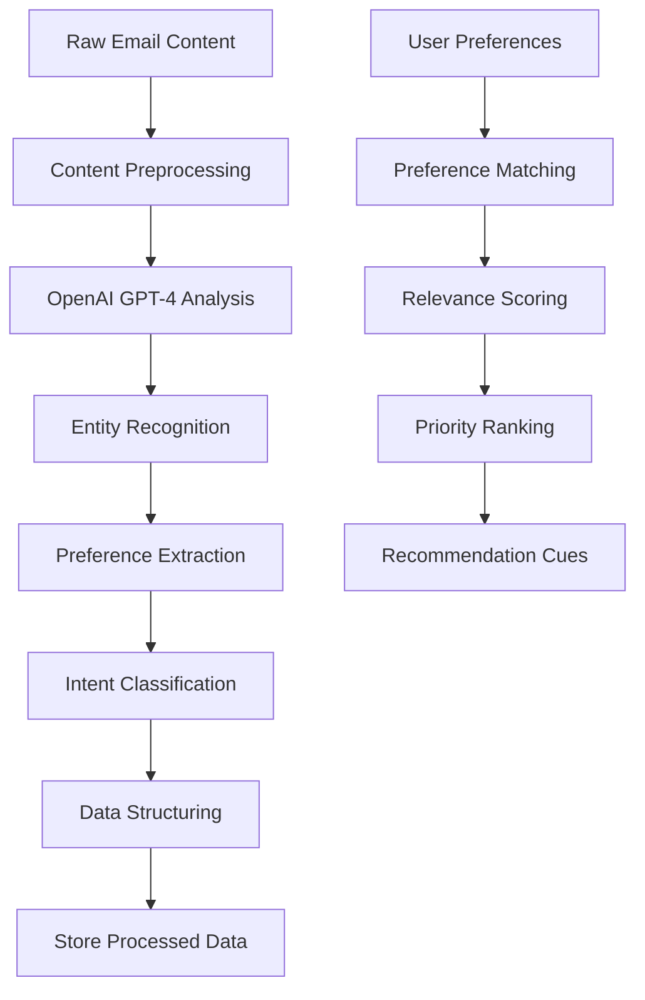
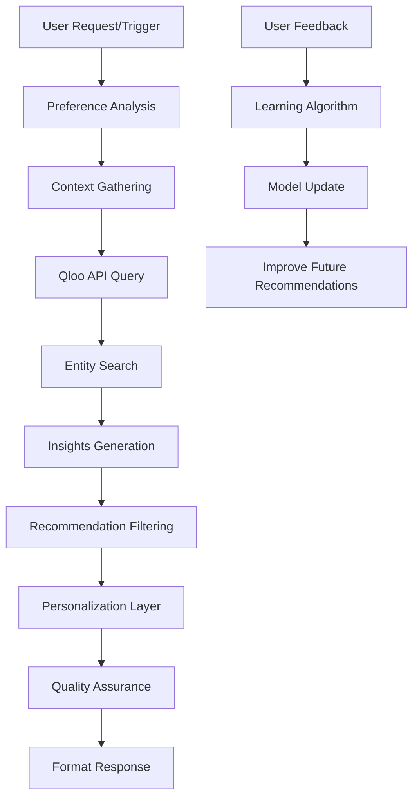
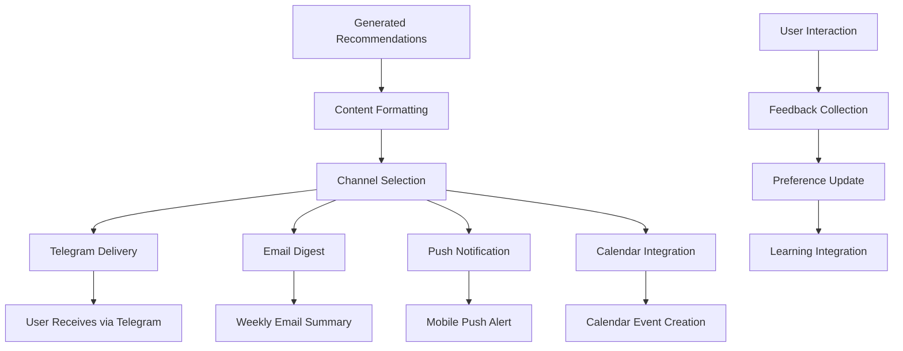
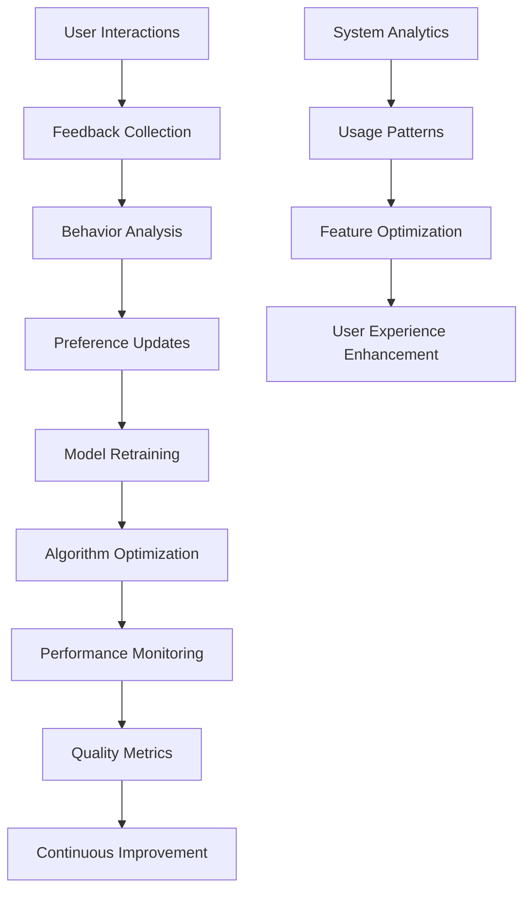

# 🚀 QlooMate - AI-Powered Go-To Companion

> Transform your email inbox into personalized recommendations using AI and cultural intelligence

[](https://nextjs.org/)
[](https://appwrite.io/)
[](https://openai.com/)
[](https://qloo.com/)

## 📖 Table of Contents

- [🎯 Overview](#-overview)
- [✨ Features](#-features)
- [🏗️ Architecture](#️-architecture)
- [🔄 How It Works](#-how-it-works)
- [🚀 Quick Start](#-quick-start)
- [⚙️ Setup Guide](#️-setup-guide)
- [🔧 Configuration](#-configuration)
- [📱 Usage](#-usage)
- [🛠️ Development](#️-development)
- [📊 API Endpoints](#-api-endpoints)
- [🤖 AI Functions](#-ai-functions)
- [🔒 Security](#-security)
- [📈 Deployment](#-deployment)
- [🤝 Contributing](#-contributing)
- [📄 License](#-license)

## 🎯 Overview

**QlooMate** is an intelligent go-to companion that transforms your email inbox into personalized recommendations. By connecting to your Gmail, analyzing your preferences and patterns, and leveraging Qloo's cultural intelligence API, it delivers hyper-personalized suggestions for restaurants, attractions, experiences, books, movies, and more based on your interests and activities.

### 🌟 What Makes QlooMate Special?

**QlooMate** stands out from traditional recommendation engines by leveraging your actual email data to understand your real interests and preferences. Unlike generic apps that rely on manual input or basic browsing history, QlooMate:

- **📧 Reads Your Emails**: Analyzes booking confirmations, newsletters, receipts, and communication patterns
- **🧠 Learns Your Patterns**: Understands your travel frequency, dining preferences, entertainment choices, and cultural interests
- **🌍 Cultural Intelligence**: Uses Qloo's API to provide culturally relevant, location-aware recommendations
- **🤖 AI-Powered**: Combines OpenAI's GPT-4 with Qloo's cultural data for intelligent suggestions
- **📱 Instant Delivery**: Sends personalized recommendations directly to your Telegram

### 🎯 Use Cases

**QlooMate** excels in various scenarios:

#### 🏠 **Daily Life**
- **Restaurant Discovery**: Find new dining spots based on your cuisine preferences and location
- **Entertainment**: Get movie, book, and music recommendations aligned with your taste
- **Local Activities**: Discover events and attractions in your area

#### ✈️ **Travel & Exploration**
- **Trip Planning**: Get destination-specific recommendations before and during travel
- **Cultural Immersion**: Discover local customs, traditions, and authentic experiences
- **Budget-Friendly Options**: Find cost-effective alternatives without compromising quality

#### 🎨 **Cultural Discovery**
- **Art & Museums**: Discover galleries and exhibitions matching your artistic interests
- **Music & Performances**: Find concerts, festivals, and venues aligned with your musical taste
- **Literature & Books**: Get reading recommendations based on your email subscriptions and purchases

#### 🍽️ **Food & Dining**
- **Cuisine Exploration**: Discover new restaurants and cuisines based on your dining history
- **Recipe Recommendations**: Get cooking suggestions based on your food-related emails
- **Dietary Preferences**: Find options that match your dietary restrictions and preferences

### 🎪 The Problem
- Users receive countless emails with valuable information about their interests and activities
- This data about preferences, bookings, and interests sits unused in email inboxes
- Generic recommendation apps don't understand your actual interests and patterns
- Missing out on personalized, culturally relevant recommendations for various aspects of life

### 💡 The Solution
- **Smart Email Integration**: Connects to Gmail and extracts information about your interests
- **AI-Powered Analysis**: Uses OpenAI to understand your preferences and patterns
- **Cultural Intelligence**: Leverages Qloo's API for intelligent recommendations
- **Instant Delivery**: Sends personalized suggestions directly to your Telegram

## ✨ Features

### 🔗 Smart Integrations
- **Gmail OAuth**: Secure connection to your email inbox
- **Telegram Bot**: Instant delivery of recommendations
- **Google Sign-In**: Seamless authentication with Appwrite

### 🧠 AI-Powered Intelligence
- **Email Analysis**: Extracts bookings, preferences, and interests from emails
- **Natural Language Processing**: Understands user intent and preferences
- **Cultural Intelligence**: Intelligent, culturally relevant recommendations
- **Preference Learning**: Adapts to your interests and style over time

### 🎯 Personalized Recommendations

QlooMate offers **15+ comprehensive preference categories** that adapt to your lifestyle:

#### 📚 **Knowledge & Learning**
- **Book Recommendations**: Based on your reading lists, book purchases, and literary interests
- **Podcast Suggestions**: Discover new podcasts aligned with your professional and personal interests
- **Educational Content**: Get recommendations for courses, workshops, and learning resources

#### 🎬 **Entertainment & Media**
- **Movie Recommendations**: Based on your ticket purchases, streaming preferences, and genre interests
- **TV Show Suggestions**: Discover new series based on your viewing history and preferences
- **Music Discovery**: Find new artists, albums, and playlists matching your musical taste
- **Video Game Recommendations**: Get gaming suggestions based on your gaming-related emails

#### 🍽️ **Food & Dining**
- **Restaurant Discovery**: Find new dining spots based on your reservation history and cuisine preferences
- **Recipe Recommendations**: Get cooking suggestions based on your food-related emails and dietary preferences
- **Foodie Challenges**: Discover new cuisines and culinary experiences
- **Dietary Accommodations**: Find options that match your dietary restrictions and health preferences

#### ✈️ **Travel & Exploration**
- **Destination Recommendations**: Based on your travel bookings, flight confirmations, and hotel reservations
- **Local Attractions**: Discover points of interest at your travel destinations
- **Cultural Experiences**: Get recommendations for authentic local experiences
- **Travel Planning**: Assistance with itinerary planning and activity suggestions

#### 🎨 **Cultural & Lifestyle**
- **Art & Museums**: Discover galleries, exhibitions, and cultural events
- **Cultural Insights**: Learn about local customs, traditions, and cultural practices
- **Seasonal Activities**: Get time-based recommendations for seasonal events and activities
- **Local Events**: Discover concerts, festivals, and community events in your area

#### 💰 **Smart Features**
- **Budget-Friendly Options**: Find cost-effective alternatives without compromising quality
- **Weather-Aware Suggestions**: Get activity recommendations based on current weather conditions
- **Time-Based Recommendations**: Receive suggestions appropriate for the time of day and season
- **Location Intelligence**: Get recommendations based on your current location or travel destinations

### 📱 User Experience

QlooMate provides a **seamless, intuitive user experience** designed for modern users:

#### 🎨 **Modern Interface**
- **Clean Design**: Minimalist, responsive interface built with Tailwind CSS
- **Dark/Light Mode**: Adaptive theme based on user preferences and system settings
- **Mobile-First**: Optimized for mobile devices with touch-friendly interactions
- **Accessibility**: WCAG 2.1 compliant with keyboard navigation and screen reader support

#### ⚡ **Real-Time Performance**
- **Live Updates**: Instant email fetching and processing with real-time notifications
- **Progressive Loading**: Smooth loading states and skeleton screens for better UX
- **Caching Strategy**: Intelligent caching for faster response times
- **Background Sync**: Continuous email monitoring without interrupting user workflow

#### 🎛️ **Customizable Dashboard**
- **Personalized Layout**: Drag-and-drop interface for customizing dashboard sections
- **Preference Management**: Intuitive controls for managing recommendation categories
- **Data Visualization**: Charts and graphs showing your recommendation patterns
- **Quick Actions**: One-click access to frequently used features

#### 📱 **Multi-Platform Delivery**
- **Telegram Integration**: Instant delivery of recommendations via Telegram bot
- **Push Notifications**: Real-time alerts for new recommendations and updates
- **Email Summaries**: Weekly digest emails with curated recommendations
- **Calendar Integration**: Add recommended events directly to your calendar

#### 🔄 **Smart Automation**
- **Intelligent Scheduling**: Recommendations delivered at optimal times based on your activity patterns
- **Context Awareness**: Suggestions based on current location, weather, and time of day
- **Learning Algorithm**: Continuously improves recommendations based on your feedback
- **Batch Processing**: Efficient handling of multiple email sources and preferences

## 🏗️ Architecture

QlooMate follows a **modern, scalable microservices architecture** designed for high performance and reliability:

```
┌─────────────────────────────────────────────────────────────────────────────┐
│                              QlooMate Architecture                          │
├─────────────────┬─────────────────┬─────────────────┬─────────────────────┤
│   Frontend      │   Backend       │   AI Services   │   External APIs     │
│   (Next.js 15)  │   (Appwrite)    │   (Serverless)  │   (Third-Party)     │
├─────────────────┼─────────────────┼─────────────────┼─────────────────────┤
│ • Dashboard     │ • Authentication│ • OpenAI GPT-4  │ • Gmail API         │
│ • Email Viewer  │ • Database      │ • Qloo Taste    │ • Qloo API          │
│ • Preferences   │ • Functions     │ • LLM Analysis  │ • Telegram Bot API  │
│ • Telegram UI   │ • Real-time     │ • Booking Search│ • Weather API       │
│ • Mobile App    │ • Storage       │ • Email Parser  │ • Calendar API      │
└─────────────────┴─────────────────┴─────────────────┴─────────────────────┘
         │                       │                       │
         │                       │                       │
         ▼                       ▼                       ▼
┌─────────────────┐    ┌─────────────────┐    ┌─────────────────┐
│   User Layer    │    │   Service Layer │    │   Data Layer    │
│   - React Hooks │    │   - API Routes  │    │   - Appwrite DB │
│   - State Mgmt  │    │   - Functions   │    │   - File Storage│
│   - UI Components│   │   - Middleware  │    │   - Cache Layer │
│   - Real-time   │    │   - Auth Logic  │    │   - Logs        │
└─────────────────┘    └─────────────────┘    └─────────────────┘
```

### 🔄 **Data Flow Architecture**



### 🏢 **System Components**

#### **Frontend Layer (Next.js 15)**
- **App Router**: Modern file-based routing with server components
- **React 19**: Latest React features with concurrent rendering
- **Tailwind CSS**: Utility-first CSS framework for responsive design
- **State Management**: React hooks with context for global state
- **Real-time Updates**: WebSocket connections for live data

#### **Backend Layer (Appwrite)**
- **Authentication**: OAuth 2.0 with Google, JWT token management
- **Database**: NoSQL database with real-time subscriptions
- **Functions**: Serverless functions for AI processing
- **Storage**: File storage for attachments and media
- **Real-time**: Live data synchronization across clients

#### **AI Services Layer**
- **OpenAI Integration**: GPT-4 for natural language processing
- **Qloo API**: Cultural intelligence and recommendation engine
- **Email Analysis**: Intelligent parsing and preference extraction
- **Recommendation Engine**: Personalized suggestion algorithm
- **Learning System**: Continuous improvement based on user feedback

#### **External APIs**
- **Gmail API**: Email access and management
- **Telegram Bot API**: Message delivery and interaction
- **Weather API**: Context-aware recommendations
- **Calendar API**: Event scheduling and reminders

### 🧩 Core Components

#### **Frontend Components (Next.js 15)**

##### **Dashboard System**
- **Main Dashboard**: Centralized interface with overview, preferences, emails, and admin tabs
- **Overview Tab**: User statistics, connection status, and quick actions
- **Preferences Tab**: Comprehensive preference management with 15+ categories
- **Emails Tab**: Email fetching, searching, and analysis interface
- **Admin Tab**: System controls, automation settings, and monitoring

##### **Email Management System**
- **EmailList Component**: Displays fetched emails with search and filter capabilities
- **EmailPopup Component**: Full email viewer with HTML rendering and metadata
- **EmailSearch Component**: Advanced search with filters for booking, travel, and interest emails
- **EmailAnalytics Component**: Visual representation of email patterns and preferences

##### **Preference Management**
- **PreferencePanel Component**: Interactive preference configuration with toggle switches
- **CategoryManager Component**: Drag-and-drop interface for organizing preference categories
- **TasteProfile Component**: Visual representation of user's taste preferences
- **RecommendationHistory Component**: Track and manage past recommendations

##### **Telegram Integration**
- **TelegramPopup Component**: Chat ID setup and connection management
- **MessageHistory Component**: Display conversation history with the Telegram bot
- **BotStatus Component**: Real-time status monitoring of Telegram bot connection

#### **Backend Services (Appwrite)**

##### **Authentication System**
- **OAuth 2.0 Provider**: Google authentication with secure token management
- **Session Management**: JWT-based sessions with automatic refresh
- **User Profile Management**: Comprehensive user profile with preferences and settings
- **Security Middleware**: Rate limiting, input validation, and security headers

##### **Database Architecture**
- **Users Collection**: User profiles, preferences, and authentication data
- **Messages Collection**: Telegram conversation history and user interactions
- **Emails Collection**: Processed email data and extracted preferences
- **Recommendations Collection**: Generated recommendations and user feedback
- **Analytics Collection**: Usage statistics and system performance metrics

##### **Serverless Functions**
- **qloo-taste Function**: Processes user requests and generates Qloo API calls
- **qloo-mate-telegram Function**: Handles Telegram bot interactions and message processing
- **llm Function**: OpenAI integration for email analysis and natural language processing
- **booking-search Function**: Searches and filters emails for booking and interest data
- **email-parser Function**: Extracts structured data from email content
- **recommendation-engine Function**: Generates personalized recommendations

##### **Real-time Services**
- **Live Updates**: Real-time synchronization of data across all clients
- **Push Notifications**: Instant delivery of recommendations and system updates
- **WebSocket Connections**: Persistent connections for live data streaming
- **Event Broadcasting**: System-wide event distribution for real-time features

#### **AI Services Layer**

##### **OpenAI Integration**
- **GPT-4 Processing**: Advanced natural language understanding and generation
- **Email Analysis**: Intelligent parsing of email content for preference extraction
- **Intent Recognition**: Understanding user requests and conversation context
- **Response Generation**: Creating natural, contextual responses to user queries

##### **Qloo API Integration**
- **Cultural Intelligence**: Location-aware, culturally relevant recommendations
- **Entity Search**: Finding relevant entities (restaurants, attractions, etc.)
- **Insights API**: Generating personalized insights based on user preferences
- **Trend Analysis**: Identifying trending recommendations and popular choices

##### **Recommendation Engine**
- **Preference Matching**: Aligning recommendations with user preferences
- **Context Awareness**: Considering location, time, weather, and user context
- **Diversity Algorithm**: Ensuring recommendation variety and discovery
- **Feedback Learning**: Continuous improvement based on user interactions

##### **Data Processing Pipeline**
- **Email Parser**: Extracting structured data from various email formats
- **Preference Extractor**: Identifying user preferences from email content
- **Data Normalization**: Standardizing data formats for consistent processing
- **Quality Assurance**: Validating and filtering recommendation quality

## 🔄 How It Works

QlooMate operates through a sophisticated **multi-stage processing pipeline** that transforms raw email data into personalized recommendations:

### 1. 📧 Email Integration & Authentication



**Detailed Process:**
- **OAuth 2.0 Flow**: Secure authentication with Google using OAuth 2.0 protocol
- **Token Management**: Secure storage of refresh tokens with encryption
- **Permission Scope**: Request minimal necessary permissions (read-only email access)
- **Real-time Monitoring**: Continuous monitoring of new emails without user intervention
- **Email Classification**: Automatic categorization of emails by type (bookings, receipts, newsletters, etc.)

### 2. 🧠 AI-Powered Email Analysis



**Analysis Components:**
- **Natural Language Processing**: GPT-4 analyzes email content for semantic meaning
- **Entity Extraction**: Identifies people, places, dates, amounts, and preferences
- **Sentiment Analysis**: Understands user satisfaction and preferences
- **Pattern Recognition**: Identifies recurring themes and interests
- **Context Understanding**: Considers email sender, timing, and relationship

### 3. 🌍 Cultural Intelligence & Recommendation Generation



**Recommendation Process:**
- **Preference Matching**: Aligns user preferences with available options
- **Cultural Context**: Considers local customs, traditions, and cultural relevance
- **Location Intelligence**: Provides location-aware recommendations
- **Temporal Awareness**: Considers time of day, season, and current events
- **Diversity Algorithm**: Ensures variety in recommendations while maintaining relevance

### 4. 📱 Multi-Channel Delivery System



**Delivery Channels:**
- **Telegram Bot**: Instant, interactive delivery with rich formatting
- **Email Digests**: Weekly summaries with curated recommendations
- **Push Notifications**: Real-time alerts for time-sensitive recommendations
- **Calendar Integration**: Automatic event creation for recommended activities
- **Web Dashboard**: Comprehensive view of all recommendations and history

### 5. 🔄 Continuous Learning & Improvement



**Learning Mechanisms:**
- **Implicit Feedback**: Tracks user interactions, clicks, and time spent
- **Explicit Feedback**: Collects direct user ratings and comments
- **A/B Testing**: Continuously tests different recommendation approaches
- **Performance Monitoring**: Tracks recommendation accuracy and user satisfaction
- **Adaptive Algorithms**: Automatically adjusts based on user behavior patterns

## 🚀 Quick Start

### Prerequisites
- Node.js 18+ 
- npm or yarn
- Google Cloud Console account
- Appwrite account
- OpenAI API key
- Qloo API key
- Telegram Bot token

### Installation

```bash
# Clone the repository
git clone https://github.com/yourusername/qloo-mate.git
cd qloo-mate

# Install dependencies
npm install

# Set up environment variables
cp .env.example .env.local

# Start development server
npm run dev
```

## ⚙️ Setup Guide

### 1. 🔐 Google OAuth Setup

1. **Create Google Cloud Project**
   ```bash
   # Go to Google Cloud Console
   https://console.cloud.google.com/
   ```

2. **Enable APIs**
   - Gmail API
   - Google+ API

3. **Create OAuth Credentials**
   ```bash
   # Add redirect URIs:
   https://cloud.appwrite.io/v1/account/sessions/oauth2/callback/google
   http://localhost:3000/success
   http://localhost:3000/failure
   ```

### 2. 🏗️ Appwrite Configuration

1. **Create Appwrite Project**
   ```bash
   # Go to Appwrite Console
   https://console.appwrite.io/
   ```

2. **Enable Google OAuth Provider**
   ```bash
   # Add your Google OAuth credentials
   Client ID: your_google_client_id
   Client Secret: your_google_client_secret
   ```

3. **Create Database Collections**
   ```bash
   # Users collection (auto-created)
   # Messages collection for Telegram history
   ```

### 3. 🤖 Telegram Bot Setup

1. **Create Bot with BotFather**
   ```bash
   # Send /newbot to @BotFather
   # Choose name: "QlooMate Bot"
   # Choose username: "qloo_mate_bot"
   ```

2. **Set Webhook**
   ```bash
   # For development (using ngrok):
   ngrok http 3000
   
   # Set webhook URL:
   https://api.telegram.org/bot{YOUR_BOT_TOKEN}/setWebhook?url=https://abc123.ngrok.io/api/telegram/webhook
   ```

### 4. 🔑 Environment Variables

Create `.env.local`:

```env
# Appwrite Configuration
NEXT_PUBLIC_APPWRITE_ENDPOINT=https://cloud.appwrite.io/v1
NEXT_PUBLIC_APPWRITE_PROJECT_ID=your_project_id
APPWRITE_API_KEY=your_api_key

# Google OAuth
GOOGLE_CLIENT_ID=your_google_client_id
GOOGLE_CLIENT_SECRET=your_google_client_secret
GOOGLE_REDIRECT_URI=http://localhost:3000/api/auth/google/callback

# OpenAI
OPENAI_API_KEY=your_openai_api_key

# Qloo API
QLOO_API_KEY=your_qloo_api_key

# Telegram Bot
TELEGRAM_BOT_TOKEN=your_telegram_bot_token

# Appwrite Functions
APPWRITE_FUNCTION_API_ENDPOINT=https://cloud.appwrite.io/v1
APPWRITE_FUNCTION_PROJECT_ID=your_project_id
```

## 🔧 Configuration

### Appwrite Functions Setup

1. **Deploy Functions**
   ```bash
   # Deploy each function to Appwrite
   cd functions/qloo-taste
   appwrite functions createDeployment --functionId=your_function_id
   
   cd ../qloo-mate-telegram
   appwrite functions createDeployment --functionId=your_function_id
   
   cd ../llm
   appwrite functions createDeployment --functionId=your_function_id
   ```

2. **Set Function Variables**
   ```bash
   # Add environment variables to each function
   OPENAI_API_KEY=your_openai_api_key
   QLOO_API_KEY=your_qloo_api_key
   TELEGRAM_BOT_TOKEN=your_telegram_bot_token
   ```

### Database Schema

```javascript
// Users Collection (Appwrite Auth)
{
  $id: "user_id",
  email: "user@example.com",
  name: "User Name",
  prefs: {
    matePreferences: "JSON string of preferences",
    taste: ["book", "travel", "movie"],
    gmailRefreshToken: "encrypted_token",
    telegramChatId: "chat_id",
    telegramConnected: true,
    isActive: true,
    lastEmailCheckTime: "timestamp"
  }
}

// Messages Collection
{
  $id: "message_id",
  chatId: "telegram_chat_id",
  userId: "user_id",
  username: "username",
  userMessage: "user input",
  aiResponse: "AI response",
  timestamp: "timestamp"
}
```

## 📱 Usage

### 1. 🚀 Getting Started

1. **Sign In**: Visit the app and sign in with Google
2. **Connect Gmail**: Click "Connect Gmail" to authorize email access
3. **Connect Telegram**: Get your chat ID and connect Telegram
4. **Set Preferences**: Customize your recommendation categories

### 2. 📧 Email Management

- **Fetch Emails**: Get recent emails from your inbox
- **Search Interests**: Find booking and interest-related emails automatically
- **Quick Summary**: Get AI-generated summaries of your plans and interests
- **Email Viewer**: View full email content in popup

### 3. 🎯 Mate Preferences

Configure 10+ preference categories:

| Category | Description | Tag |
|----------|-------------|-----|
| 📚 Book Recommendations | From reading lists | `book` |
| ✈️ Travel Plans | From bookings | `travel` |
| 🎬 Movie Bookings | From tickets | `movie` |
| 🍽️ Dining | From reservations | `dining` |
| 👨‍🍳 Recipes | Local cooking | `recipe` |
| 🎪 Foodie Challenges | Food exploration | `challenge` |
| 🌍 Cultural Insights | Local customs | `culture` |
| 🌤️ Weather Alerts | Weather-based | `weather` |
| 💰 Budget Tips | Cost-saving | `budget` |
| 🍂 Seasonal | Time-based | `seasonal` |

### 4. 🤖 QlooMate Automation

- **Manual Execution**: Run QlooMate on-demand
- **Email Analysis**: Automatically processes new emails for interests and preferences
- **Recommendation Generation**: Creates personalized suggestions based on your interests
- **Telegram Delivery**: Sends results instantly

### 5. 💬 Telegram Interaction

- **Direct Chat**: Send messages to get recommendations
- **Taste-Based**: AI understands your preferences and interests
- **Cultural Intelligence**: Intelligent suggestions based on your taste
- **Conversation History**: Maintains context

## 🛠️ Development

### Project Structure

```
qloo-mate/
├── app/                    # Next.js app directory
│   ├── api/               # API routes
│   ├── dashboard/         # Main dashboard
│   ├── qloo/             # Qloo API testing
│   └── layout.js         # Root layout
├── components/            # React components
│   ├── EmailList.js      # Email display
│   ├── EmailPopup.js     # Email viewer
│   ├── SummaryPopup.js   # Summary display
│   ├── TelegramPopup.js  # Telegram setup
│   └── UserMessages.js   # Message history
├── functions/            # Appwrite serverless functions
│   ├── qloo-taste/      # Qloo API integration
│   ├── qloo-mate-telegram/ # Telegram bot
│   ├── llm/             # OpenAI integration
│   └── booking-search/  # Email search
├── lib/                 # Utility libraries
│   ├── appwrite.js      # Appwrite client
│   ├── auth.js          # Authentication
│   └── gmail.js         # Gmail integration
└── qloo/               # Qloo API types
    └── api.ts          # TypeScript definitions
```

### Development Commands

```bash
# Install dependencies
npm install

# Start development server
npm run dev

# Build for production
npm run build

# Start production server
npm start

# Run linting
npm run lint

# Deploy functions
cd functions/qloo-taste
appwrite functions createDeployment --functionId=your_function_id
```

### Code Style

- **Frontend**: React with functional components and hooks
- **Styling**: Tailwind CSS for responsive design
- **State Management**: React useState and useEffect
- **API Calls**: Fetch API with error handling
- **Type Safety**: JSDoc comments for type hints

## 📊 API Endpoints

### Authentication
- `GET /api/auth/google` - Google OAuth initiation
- `GET /api/auth/google/callback` - OAuth callback handler

### Gmail Integration
- `GET /api/gmail` - Fetch emails
- `GET /api/gmail/search` - Search for booking and interest emails
- `POST /api/gmail/connect` - Connect Gmail account
- `DELETE /api/gmail/disconnect` - Disconnect Gmail

### Telegram Integration
- `POST /api/telegram/webhook` - Bot webhook handler
- `GET /api/telegram/bot-info` - Bot information

### User Management
- `GET /api/user/preferences` - Get user preferences
- `PUT /api/user/preferences` - Update preferences

### Appwrite Functions
- `POST /functions/qloo-taste` - Process taste-based requests
- `POST /functions/qloo-mate-telegram` - Handle Telegram interactions
- `POST /functions/llm` - OpenAI integration
- `POST /functions/booking-search` - Search for booking and interest emails

## 🤖 AI Functions

### qloo-taste Function
Processes user requests and generates Qloo API calls:

```javascript
// Input: User inspiration text
{
  "inspiration": "I'm going to Tokyo next week, recommend some restaurants"
}

// Output: Qloo API recommendations
{
  "success": true,
  "results": [
    {
      "name": "Sukiyabashi Jiro",
      "type": "restaurant",
      "location": {...},
      "properties": {...}
    }
  ]
}
```

### qloo-mate-telegram Function
Handles Telegram bot interactions:

```javascript
// Input: Telegram message
{
  "message": {
    "chat": {"id": "123456789"},
    "text": "Recommend restaurants in Paris"
  }
}

// Output: AI response
{
  "response": "Based on your preferences, here are some great restaurants in Paris..."
}
```

### llm Function
OpenAI integration for email analysis:

```javascript
// Input: Email content
{
  "email": "Your flight to Tokyo is confirmed..."
}

// Output: Extracted information
{
  "destination": "Tokyo",
  "dates": "2024-01-15 to 2024-01-20",
  "preferences": ["food", "culture"],
  "interests": ["travel", "dining"]
}
```

## 🔒 Security

### Authentication
- **Google OAuth**: Secure third-party authentication
- **Appwrite Sessions**: Server-side session management
- **Token Encryption**: Secure storage of API tokens

### Data Protection
- **HTTPS Only**: All communications encrypted
- **Environment Variables**: Sensitive data in .env files
- **Input Validation**: Sanitize all user inputs
- **Rate Limiting**: Prevent API abuse

### Privacy
- **Email Access**: Read-only Gmail access
- **Data Retention**: Configurable data retention policies
- **User Control**: Users can disconnect services anytime
- **GDPR Compliance**: User data deletion capabilities

## 📈 Deployment

### Production Setup

1. **Environment Variables**
   ```bash
   # Set production environment variables
   NEXT_PUBLIC_APPWRITE_ENDPOINT=https://cloud.appwrite.io/v1
   NEXT_PUBLIC_APPWRITE_PROJECT_ID=your_production_project_id
   ```

2. **Domain Configuration**
   ```bash
   # Update OAuth redirect URIs
   https://yourdomain.com/success
   https://yourdomain.com/failure
   
   # Update Telegram webhook
   https://api.telegram.org/bot{YOUR_BOT_TOKEN}/setWebhook?url=https://yourdomain.com/api/telegram/webhook
   ```

3. **SSL Certificate**
   ```bash
   # Ensure HTTPS is enabled
   # Required for OAuth and webhooks
   ```

### Deployment Platforms

#### Vercel (Recommended)
```bash
# Install Vercel CLI
npm i -g vercel

# Deploy
vercel --prod
```

#### Netlify
```bash
# Build the project
npm run build

# Deploy to Netlify
# Connect your GitHub repository
```

#### Docker
```dockerfile
# Dockerfile
FROM node:18-alpine
WORKDIR /app
COPY package*.json ./
RUN npm ci --only=production
COPY . .
RUN npm run build
EXPOSE 3000
CMD ["npm", "start"]
```

## 🤝 Contributing

### Development Workflow

1. **Fork the repository**
2. **Create feature branch**
   ```bash
   git checkout -b feature/amazing-feature
   ```
3. **Make changes and test**
4. **Commit with conventional commits**
   ```bash
   git commit -m "feat: add new preference category"
   ```
5. **Push to branch**
   ```bash
   git push origin feature/amazing-feature
   ```
6. **Create pull request**

### Code Standards

- **ESLint**: Follow linting rules
- **Prettier**: Consistent code formatting
- **TypeScript**: Add types where possible
- **Testing**: Write tests for new features
- **Documentation**: Update docs for changes

### Issue Reporting

- **Bug Reports**: Include steps to reproduce
- **Feature Requests**: Describe use case and benefits
- **Security Issues**: Report privately to maintainers

## 📄 License

This project is licensed under the MIT License - see the [LICENSE](LICENSE) file for details.

## 🙏 Acknowledgments

- **Qloo**: Cultural intelligence API
- **OpenAI**: GPT-4 integration
- **Appwrite**: Backend-as-a-Service
- **Next.js**: React framework
- **Tailwind CSS**: Styling framework
- **Telegram**: Bot platform

## 📞 Support

- **Documentation**: [Wiki](https://github.com/yourusername/qloo-mate/wiki)
- **Issues**: [GitHub Issues](https://github.com/yourusername/qloo-mate/issues)
- **Discussions**: [GitHub Discussions](https://github.com/yourusername/qloo-mate/discussions)
- **Email**: support@qloo-mate.com

---

<div align="center">

**Made with ❤️ by the QlooMate Team**

[](https://github.com/yourusername/qloo-mate)
[](https://github.com/yourusername/qloo-mate)
[](https://github.com/yourusername/qloo-mate/issues)

</div> 